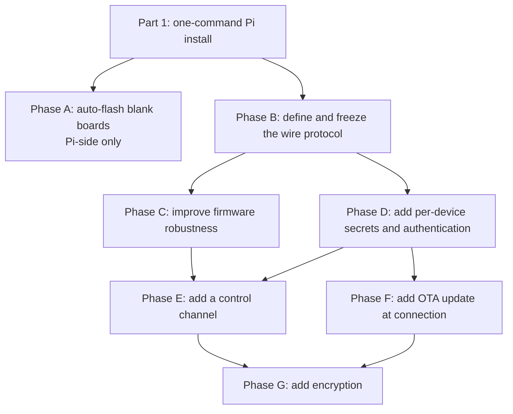

# One-command Raspberry Pi setup and Pico lifecycle

## Purpose

This project has two goals.

1. One command must configure a Raspberry Pi.
2. A blank Pico must provision itself and operate securely.

The Raspberry Pi setup must install the services, udev rules, firmware files, key store, and configuration files. After the setup, the Raspberry Pi must relay serial data.

The Pico lifecycle must support these functions:

- Automatic provisioning
- Fault recovery
- Remote status and control
- Over-the-air firmware updates
- Device authentication
- Transport encryption

## Scope

This project is for new hardware.

Use new Raspberry Pis and new Pico boards.

Do not make this system compatible with the installed system. Treat the installed system as a different project.

This decision removes these requirements:

- Backward compatibility
- Dual-mode registration
- Reconciliation of unknown firmware with the repository

Define and freeze the wire protocol before you deploy the first Pico.

A protocol change after deployment can require a physical visit to each Pico.

## Current problems

### The installer does not complete the setup

The file `bin/remote-serial-pico.js` has these problems.

1. It runs `sudo npm install` before it clones the repository.
2. It runs `sudo npm install` in the current directory.
3. The file `config.yaml` is not in git.
4. A new clone does not contain `config.yaml`.
5. `PtyServer.js` cannot start without `config.yaml`.
6. The file `ptyserver.service` is not in git.
7. The service file contains `User=mieweb`.
8. The service file contains an absolute nvm path.
9. The service file works on only one configured machine.
10. The installer runs `systemctl start ptyserver.service` without `sudo`.
11. The installer does not run `systemctl enable`.
12. The service does not start after a reboot.
13. The installer creates the project directory with mode `777`.
14. udev runs deployment scripts from this directory as root.
15. A local user can change a script that root will run.
16. This condition permits local privilege escalation.
17. The installer, service file, and udev rule contain hardcoded paths.

The current installer requires manual repair after it runs.

### Provisioning is incomplete

A new Pico has erased flash.

The deployer uses `rshell`. `rshell` requires a MicroPython REPL.

The current udev rule matches only USB ID `2e8a:0005`. This interface is present only after MicroPython is installed.

A new Pico does not start an action when a user connects it. The system does not write a log entry or an error.

The user must manually download a UF2 file and copy it to the Pico.

### The firmware cannot recover from some faults

The file `src/pico/main.py` has these problems.

1. `uart1.read().decode('utf-8')` is outside the inner `try` block.
2. One invalid UTF-8 byte can stop the main loop.
3. The outer `try`, `except`, and `finally` blocks contain the complete loop.
4. An unhandled exception is terminal.
5. The firmware does not use a watchdog.
6. A blocked Pico remains blocked until a person cycles the power.
7. `except Exception: pass` around `s.recv()` hides the cause of an error.
8. The firmware cannot distinguish no data from a broken socket.
9. A half-open connection can remain undetected.
10. `s.send()` can send only part of a buffer.
11. A partial send can truncate data without an error.
12. The firmware changes the socket between blocking and nonblocking modes.
13. The firmware uses `time.sleep(0.05)` instead of `select.poll()` or `uasyncio`.
14. The firmware does not report a version.

### The connection is not authenticated or encrypted

The Raspberry Pi and Pico use raw TCP.

The source files do not use `ssl` or TLS.

`PtyServer` listens on `*:50000`.

Registration is an unauthenticated text assertion.

An unauthorized host can send a valid-looking Pico identifier. For example, it can send `pico_e6614103e71d2c2f`.

When this occurs, `handlePicoConnection()` destroys the valid socket and assigns the pty to the unauthorized host.

The unauthorized host can receive commands from Node-RED. It can also inject responses.

WPA2 protects the radio link. It does not authenticate devices on the local network.

A client that has the Wi-Fi pre-shared key can capture a board handshake and decrypt its traffic.

The Wi-Fi pre-shared key is in clear text in `src/pico/config.json`. The same file is on each board and in git.

### There is no control channel

The system cannot perform these actions remotely:

- Reboot a Pico
- Get Pico status
- Change the UART baud rate
- Blink the Pico LED to identify the board

A person must visit the Pico for each intervention.

## Implementation sequence



Obey these sequence requirements.

### Define the protocol before you change the firmware

Later phases add these message types:

- Authentication challenge
- Authentication response
- Control request
- Control response
- Update payload
- Version report

Define these message types in Phase B.

Reserve all required opcodes in Phase B, including opcodes for functions that are not implemented.

Do not add fields to an unframed protocol after deployment. New fields can enter the UART data stream as invalid data.

A protocol change can require a reflash of each installed Pico.

### Add authentication before OTA update

Do not send firmware on an unauthenticated connection.

An unauthorized host could install arbitrary code on each Pico.

Do not release Phase F before Phase D.

Phase A changes only the Raspberry Pi. You can do Phase A at the same time as the other work.

# Part 1: One-command Raspberry Pi setup

## Target command

Use this command on a clean Raspberry Pi OS image:

```sh
npm i -g remote-serial-pico
remote-serial-pico install
```

After the command completes, the Raspberry Pi must relay serial data.

The command must not require manual file edits or undocumented actions.

## Requirements

- [ ] Define one `installRoot`.
- [ ] Let the installer select `installRoot`, or accept it from `--root`.
- [ ] Derive `symlinkDir`, `FirmwareDir`, `PicoSerialMap`, `PicoSecrets`, and log paths from `installRoot`.
- [ ] Do not hardcode these paths in the installer, service unit, or udev rule.
- [ ] Generate `config.yaml` from `config.example.yaml`.
- [ ] Put detected values in the generated file.
- [ ] Detect the LAN address to bind.
- [ ] Detect the service user.
- [ ] Resolve all required paths.
- [ ] Commit `config.example.yaml`.
- [ ] Do not commit the generated `config.yaml`.
- [ ] Generate `ptyserver.service` from a template.
- [ ] Put the correct service user in the generated service file.
- [ ] Resolve the Node.js executable with `which node`.
- [ ] Put the resolved Node.js path in the service file.
- [ ] Commit the service template.
- [ ] Do not commit the generated service unit.
- [ ] Run `sudo systemctl daemon-reload`.
- [ ] Run `sudo systemctl enable --now ptyserver.service`.
- [ ] Verify that the service is active.
- [ ] Clone the repository before you run `npm install`.
- [ ] Run `npm install` in the cloned repository.
- [ ] Make the service user the owner of the project directory.
- [ ] Do not make the project directory world-writable.
- [ ] Set `PicoSecrets` to mode `0600`.
- [ ] Install udev rules for blank boards.
- [ ] Install udev rules for boards that run MicroPython.
- [ ] Run `udevadm control --reload-rules`.
- [ ] Run `udevadm trigger`.
- [ ] Download and cache the MicroPython UF2 files in `FirmwareDir`.
- [ ] Require an internet connection only during installation.
- [ ] Create a Python virtual environment.
- [ ] Install `rshell` in the virtual environment.
- [ ] Derive the Python interpreter path.
- [ ] Initialize the key store for Phase D.
- [ ] Bind the TCP server to the LAN address.
- [ ] Do not bind the TCP server to `0.0.0.0`.
- [ ] Offer an option to restrict the TCP port to the Pico subnet with a firewall.
- [ ] Make the installer idempotent.
- [ ] Preserve `PicoSerialMap` when the installer runs again.
- [ ] Preserve `PicoSecrets` when the installer runs again.
- [ ] Add `remote-serial-pico doctor`.
- [ ] Make `doctor` verify that the service is active.
- [ ] Make `doctor` verify that the expected address and port are listening.
- [ ] Make `doctor` verify that the udev rules are loaded.
- [ ] Make `doctor` verify that the firmware files are cached.
- [ ] Make `doctor` verify that the configuration is valid.
- [ ] Make `doctor` verify file ownership and permissions.
- [ ] Add `remote-serial-pico status`.
- [ ] Make `status` list all known Pico boards.
- [ ] Show whether each Pico is connected.
- [ ] Show each port name.
- [ ] Show each firmware version.
- [ ] Update the README.
- [ ] Remove obsolete manual-repair instructions from the README.

## Package layout decision

The current installer uses a global npm package and a cloned repository.

Select one installation model.

Use one of these models:

1. The npm package contains the complete installation. Do not clone the repository.
2. The npm command is a small wrapper that installs and manages a repository clone.

Do not use both models without a defined reason.

Using both models caused path differences in the current implementation.

# Part 2: Pico lifecycle

## Phase A: Automatically flash blank boards

### Objective

Detect a Pico in BOOTSEL mass-storage mode.

Copy a cached MicroPython UF2 file to the board.

Let the board restart.

After restart, the board appears as USB ID `2e8a:0005`.

Then, the MicroPython deployment rule must run.

A user must be able to connect a blank Pico and get a working serial port.

### USB states

| State | USB ID | FAT label | Handled now |
| --- | --- | --- | --- |
| Blank or BOOTSEL, RP2040 Pico W | `2e8a:0003` | `RPI-RP2` | No |
| Blank or BOOTSEL, RP2350 Pico 2 W | `2e8a:000f` | `RP2350` | No |
| MicroPython is running | `2e8a:0005` | Not applicable | Yes |

### Requirements

- [ ] Extend `src/pi/99-pico.rules`.
- [ ] Match USB ID `2e8a:0003`.
- [ ] Match USB ID `2e8a:000f`.
- [ ] Add `src/pi/PicoFirmwareFlasher.py`.
- [ ] Select the UF2 file from the USB product ID.
- [ ] Mount the Pico storage.
- [ ] Copy the UF2 file.
- [ ] Sync the filesystem.
- [ ] Unmount the Pico storage.
- [ ] Log the result.
- [ ] Start the flash operation with `systemd-run --no-block` or a systemd template unit.
- [ ] Do not run the flash operation directly in udev `RUN+=`.
- [ ] Move the current `rshell` transfer out of udev `RUN+=`.
- [ ] Require an `autoflash-enabled` marker in `FirmwareDir`.
- [ ] Do not flash a board when the marker is absent.

udev can terminate a long `RUN` process after approximately 30 seconds.

A long `RUN` process also blocks the udev event queue.

A UF2 file can be approximately 1.5 MB. A write to slow USB storage can exceed the safe udev execution time.

### Implementation notes

#### Device removal after copy

The Pico restarts when the UF2 file reaches the board.

The block device can disappear before `cp` returns.

`cp` can return an I/O error after a successful flash.

Treat device removal after the write as a possible success condition.

Verify the expected sequence before you report failure.

#### Mount race

The udev `add` event can occur before the FAT filesystem is ready.

Match the partition when `ENV{ID_FS_LABEL}` is available, or retry the mount operation.

#### Flash tool

`picotool load -x` can write directly through PICOBOOT.

This method does not require a filesystem mount.

However, `picotool` is not in the standard Raspberry Pi OS apt repositories.

Use `udisksctl` and a mount-and-copy method for the first implementation.

You can evaluate `picotool` later.

#### Pico model detection

A Pico W and a plain Pico can both report USB ID `2e8a:0003` in BOOTSEL mode.

The system cannot distinguish these boards in this mode.

Assume that an RP2040 board is a Pico W.

A plain Pico that receives Pico W firmware can blink its LED continuously and fail to operate correctly.

The system can distinguish RP2040 from RP2350. Therefore, the system can reliably select between RP2040 and RP2350 UF2 files.

#### Flash safety

A board shows the `RPI-RP2` storage label only when its flash is blank or when a person holds BOOTSEL.

The automatic process cannot overwrite normal running firmware unless a person puts the board in BOOTSEL mode.

## Phase B: Define and freeze the wire protocol

### Objective

Define the complete protocol before board deployment.

Implement the protocol in phases.

### Requirements

- [ ] Use delimited framing.
- [ ] Include an explicit message type in each frame.
- [ ] Reserve opcodes for registration.
- [ ] Reserve opcodes for serial data.
- [ ] Reserve opcodes for heartbeat messages.
- [ ] Reserve opcodes for authentication challenges.
- [ ] Reserve opcodes for authentication responses.
- [ ] Reserve opcodes for control requests.
- [ ] Reserve opcodes for control responses.
- [ ] Reserve opcodes for update messages.
- [ ] Include a protocol version in registration.
- [ ] Include a firmware version or firmware hash in registration.
- [ ] Refuse a board that uses an incompatible protocol.
- [ ] Use sequence numbers in the first protocol version.
- [ ] Use sequence numbers for replay protection in later phases.
- [ ] Do not send control traffic to the UART.
- [ ] Do not send update traffic to the UART.
- [ ] Do not send control or update traffic to the pty.
- [ ] Keep the pty byte-transparent.
- [ ] Put the protocol specification in the repository.
- [ ] Treat the specification as the contract between the Python firmware and the Node.js server.

## Phase C: Improve firmware robustness

### Requirements

- [ ] Put the main operation in a restartable loop.
- [ ] Do not let an exception terminate the firmware permanently.
- [ ] Close the socket after a connection error.
- [ ] Blink the LED to show an error.
- [ ] Reconnect to the Raspberry Pi.
- [ ] Register again after reconnect.
- [ ] Add `machine.WDT(timeout=8000)`.
- [ ] Feed the watchdog during normal operation.
- [ ] Feed or suspend the watchdog during an OTA write.
- [ ] Use `decode('utf-8', 'replace')`.
- [ ] Handle a `None` result from `uart1.read()`.
- [ ] Handle `EAGAIN` as a normal no-data condition.
- [ ] Reconnect for other socket errors.
- [ ] Use `sendall()`, or loop until `send()` sends the complete buffer.
- [ ] Replace blocking-mode changes and `time.sleep(0.05)`.
- [ ] Use `select.poll()` or `uasyncio`.
- [ ] Keep normal latency below the current value of approximately 50 ms.
- [ ] Add exponential or bounded reconnect backoff.
- [ ] Prevent all Pico boards from rapidly reconnecting when the Raspberry Pi is unavailable.

At 19200 baud, the data rate is approximately 1.9 KB/s.

This rate gives sufficient processing margin for polling or asynchronous I/O.

## Phase D: Add per-device secrets and authentication

### Requirements

- [ ] Generate a random 256-bit key for each Pico in `PicoScriptDeployer.py`.
- [ ] Generate the key during USB provisioning.
- [ ] Treat USB provisioning as the trusted enrollment path.
- [ ] Write the key to the Pico `config.json`.
- [ ] Store the key on the Raspberry Pi in `PicoSecrets`.
- [ ] Set `PicoSecrets` to mode `0600`.
- [ ] Make the service user the owner of `PicoSecrets`.
- [ ] Do not commit `PicoSecrets`.
- [ ] Do not write a secret to a log.
- [ ] Do not derive a secret from the Pico serial ID.
- [ ] Do not use the Wi-Fi pre-shared key as the device secret.
- [ ] Use a different key for each Pico.
- [ ] Do not use one key for the complete fleet.
- [ ] Use challenge-response authentication during registration.
- [ ] Make the Raspberry Pi send a random nonce.
- [ ] Make the Pico calculate `HMAC-SHA256(secret, nonce || serialId)`.
- [ ] Make the Pico return the calculated value.
- [ ] Reject the registration when the value is incorrect.
- [ ] Log the rejected registration without logging secret data.
- [ ] Refuse all unauthenticated registrations.
- [ ] Do not implement a legacy unauthenticated mode.
- [ ] Support key rotation through USB reprovisioning.
- [ ] Add remote key rotation in Phase E.

MicroPython includes `hashlib.sha256`.

If MicroPython does not include an HMAC function, add a small HMAC helper.

The key remains as clear text in the Pico filesystem.

A person with physical USB access and REPL access can read the key.

Physical access is outside the scope of this project.

Per-device keys limit the effect of one compromised board.

## Phase E: Add a control channel

### Commands

| Command | Function |
| --- | --- |
| `reboot` | Run `machine.reset()` |
| `status` | Report firmware hash, uptime, RSSI, free memory, reconnect count, and UART error counts |
| `uart set <baud> [bits parity stop]` | Change the UART configuration |
| `identify` | Blink the LED for a specified time |
| `listen` | Send raw UART bytes as hexadecimal data to a debug client without stopping normal relay |
| `update` | Start a firmware update |
| `rotate-key` | Replace the device secret |

### Requirements

- [ ] Authenticate each control command.
- [ ] Reject an unauthenticated `reboot`.
- [ ] Reject an unauthenticated `uart set`.
- [ ] Make UART changes temporary by default.
- [ ] Save a UART change to `config.json` only when the operator uses `--save`.
- [ ] Restore the saved UART configuration after a power cycle.
- [ ] Use a control channel that is separate from the pty.
- [ ] Keep the pty as the serial data channel.
- [ ] Prefer a Unix domain socket on the Raspberry Pi for control.
- [ ] Add a CLI such as `remote-serial-pico ctl <name> reboot`.
- [ ] Evaluate a second control pty only when Node-RED must send control commands.
- [ ] Log each control command.
- [ ] Log the result of each control command.

An unauthenticated `reboot` can cause a building-wide denial of service.

An unauthenticated `uart set` can silently stop communication with the connected serial device.

## Phase F: Update firmware when a Pico connects

### Update sequence

```text
Pico connects.
Pico registration includes the firmware hash.
The Raspberry Pi compares the hash with the canonical firmware.

If the hashes match:
  Continue normal operation.

If the hashes do not match:
  The Raspberry Pi sends UPDATE, length, hash, and payload.
  The Pico writes the payload to a temporary file.
  The Pico verifies the length and hash.
  The Pico replaces the firmware file.
  The Pico runs machine.reset().
  The Pico reconnects.
  The Pico reports the new hash.
  The Raspberry Pi logs the result.
```

### Requirements

- [ ] Calculate the hash of the canonical `src/pico/main.py` when `PtyServer` starts.
- [ ] Compare the canonical hash with the Pico hash during registration.
- [ ] Log the old and new versions.
- [ ] Define the update message.
- [ ] Define payload chunking.
- [ ] Define completion acknowledgments.
- [ ] Define failure acknowledgments.
- [ ] Write new firmware to a temporary file.
- [ ] Verify the total length before replacement.
- [ ] Verify the hash before replacement.
- [ ] Replace `main.py` only after successful verification.
- [ ] Reset the Pico after successful replacement.
- [ ] Start updates only during registration.
- [ ] Complete the update before serial relay starts.
- [ ] Do not update firmware during an active serial operation.
- [ ] Make OTA rollout opt-in.
- [ ] Update one Pico at a time.
- [ ] Log each update result.

### Recovery and bricking protection

Put the updater in `boot.py`.

Do not put the only updater logic in `main.py`.

`boot.py` runs before `main.py`. A stable updater in `boot.py` can repair a damaged or crash-looping `main.py`.

Keep `boot.py` small and stable.

Verify firmware before replacement.

Keep the previous firmware as a fallback.

Restore the previous firmware when the new firmware fails on its first boot.

Test on a bench Pico first.

Then update one production canary.

Update the remaining Pico boards only after the canary succeeds.

Do not update more than one production Pico at the same time.

## Phase G: Add transport encryption

Phase D prevents device impersonation.

Phase G protects the confidentiality and integrity of serial traffic.

Select one of these methods during implementation.

### Option 1: TLS

Use MicroPython `ssl` and mbedTLS.

Use a self-signed certificate on the Raspberry Pi.

Pin the certificate fingerprint on each Pico.

TLS uses a standard and reviewed protocol.

Certificate handling on the Pico can be difficult.

The TLS handshake can use significant memory on an RP2040, which has 264 KB of RAM.

A Pico 2 W with an RP2350 has more available memory.

The handshake cost occurs when the connection starts. It does not add the same cost to each serial message.

### Option 2: AES-CTR with HMAC

Use `ucryptolib`.

Use the per-device key.

Use a different nonce for each session.

Encrypt first.

Then calculate a MAC over the ciphertext.

Include sequence numbers in the MAC input.

Reject reused sequence numbers.

Use a constant-time comparison for MAC values.

This method has low and predictable resource use.

However, it is a custom cryptographic protocol and requires a complete specification and careful review.

### Selection rule

Prefer TLS when it fits in memory with the complete Pico workload.

Measure memory use before you select the method.

# Rollout

This project installs new hardware. It is not a migration.

- [ ] Freeze the Phase B protocol before the first deployment.
- [ ] Test with one bench Raspberry Pi and one bench Pico.
- [ ] Run the complete sequence from install to serial relay.
- [ ] Start with a clean Raspberry Pi OS image.
- [ ] Connect a blank Pico.
- [ ] Verify automatic flashing.
- [ ] Verify MicroPython deployment.
- [ ] Verify authentication.
- [ ] Verify serial relay.
- [ ] Deploy one production canary.
- [ ] Verify the canary before wider deployment.
- [ ] Deploy the remaining boards.
- [ ] Combine firmware changes into the smallest practical number of USB flashes.
- [ ] Use Phase F for later firmware changes.

# Acceptance criteria

## Raspberry Pi installation

- `remote-serial-pico install` completes on a clean Raspberry Pi OS image.
- The installer does not require manual editing.
- The service is enabled.
- The service is active.
- The service binds to the LAN address.
- The system returns to operation after a Raspberry Pi reboot.
- A second installer run preserves the device map.
- A second installer run preserves the key store.
- `remote-serial-pico doctor` reports all valid checks as successful.
- `remote-serial-pico doctor` reports an intentional fault correctly.
- A path is not hardcoded in more than one location.
- The installer does not create a world-writable file or directory.

## Provisioning

- A new Pico W becomes a usable port under `symlinkDir` without manual work.
- The system does not flash a Pico when the kill-switch marker is absent.
- The new rule does not change a Pico that already runs MicroPython.
- The system does not require internet access after installation.

## Robustness

- Each Pico reports its firmware version.
- The reported version matches the version in git.
- The version is visible in the `PtyServer` logs.
- The version is visible in `remote-serial-pico status`.
- Invalid UTF-8 from the UART does not disconnect the Pico.
- Each Pico reconnects after the TCP server stops and starts again.
- The watchdog resets a deliberately blocked Pico.
- A person does not need to visit the Pico for these recovery tests.

## Updates

- A committed firmware change installs when the Pico connects again.
- The log contains the old version.
- The log contains the new version.
- The Pico rejects a truncated update.
- The Pico rejects an update with an incorrect hash.
- The Pico continues to run the previous firmware after a rejected update.

## Security

- The server rejects and logs registration without the correct device secret.
- A network capture does not reveal serial commands or responses.
- The server rejects a replayed valid session.
- Each Pico has a unique secret.
- Secrets are not in git.
- Secrets are not in logs.
- `reboot` works on an authenticated live Pico.
- `status` works on an authenticated live Pico.
- `identify` works on an authenticated live Pico.
- `uart set` works on an authenticated live Pico.
- Control messages do not enter the pty stream.
- A power cycle recovers from an incorrect temporary UART setting.
- Hosts outside the Pico subnet cannot connect to the TCP port.

# Additional notes

Do not change the Pico firmware from MicroPython to C for performance.

At 19200 baud, C does not give a necessary performance benefit.

The C SDK would remove or complicate these current functions:

- Filesystem-based configuration
- `rshell` deployment
- File-based OTA updates

A C implementation would also require a bootloader design for Phase F.

The required changes can be implemented in MicroPython.

The file `src/pi/c/PtyServer.c` is an obsolete libuv implementation.

It uses sequential Pico numbers.

Its `DEFAULT_TCP_PORT` is `5000`, but the current port is `50000`.

Delete this file in a separate change.

Node-RED is outside the scope of this project.

However, Node-RED listens on `0.0.0.0:1880` by default.

Verify that `adminAuth` is configured in `settings.js` on each new Raspberry Pi.

An unauthenticated Node-RED editor lets a network user add an `exec` node.

An `exec` node can run arbitrary code as the Node-RED service user.

Stop tracking `src/pico/config.json`.

This file contains the active Wi-Fi pre-shared key.

The deployment process changes this file for each board.

Provide `config.example.json` instead.

Do not track generated service files or generated configuration files.

Provide `.example` or template files instead.

# Source files

- `bin/remote-serial-pico.js`: installer
- `src/pi/ptyserver.service`: service unit that must become a template
- `src/pi/PtyServer.js`: `handlePicoConnection()` and `REGISTRATION_PATTERN`
- `src/pi/PicoScriptDeployer.py`: provisioning and secret generation
- `src/pi/99-pico.rules`: current udev rule for `2e8a:0005`
- `src/pi/config.yaml`: configuration with new `FirmwareDir` and `PicoSecrets` keys
- `src/pico/main.py`: Pico firmware
- MicroPython download site: <https://micropython.org/download/>
