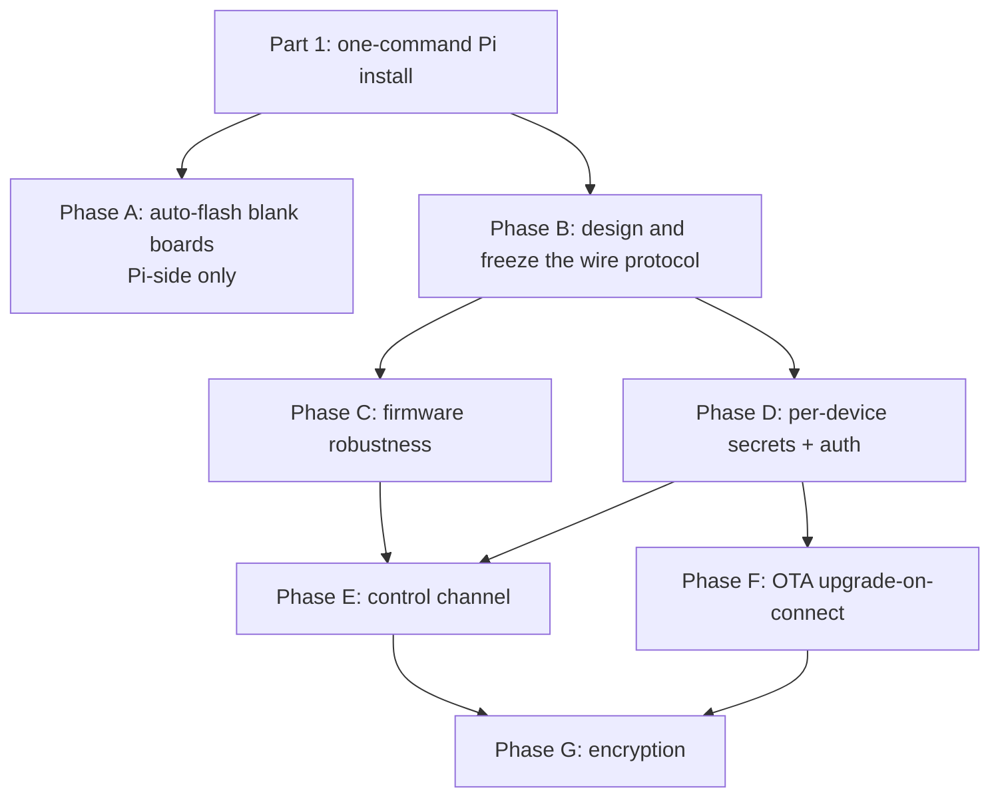

# One-command Pi setup and Pico lifecycle: provisioning, robustness, updates, and transport security

Two goals:

1. **One script sets up a Raspberry Pi end to end** — services, udev rules, cached
   firmware, key store, config — and leaves it ready to relay serial data.
2. **A Pico lifecycle worth having** — plug in a blank board and it provisions
   itself, survives faults, can be inspected and controlled remotely, updates over
   the air, and cannot be impersonated.

## Scope

This is greenfield. New hardware, fresh Pis, fresh boards. Nothing here needs to
interoperate with what is currently deployed; that installation is a separate
effort.

That is worth more than it sounds. It means no backward compatibility, no dual-mode
registration, no reconciling mystery firmware against the repo — and, most usefully,
it means the wire protocol can be designed once and frozen **before** the first
board ships. Every protocol change after deployment is a physical visit to every
Pico in the building.

## Problems

**The install does not finish the job.** `bin/remote-serial-pico.js` gets partway
and stops:

1. `sudo npm install` runs in whatever directory the user happened to be in, and
   runs *before* the repo is cloned. It installs nothing useful.
2. `config.yaml` is gitignored, so a fresh clone has no config at all and
   `PtyServer.js` cannot start.
3. `ptyserver.service` is gitignored and hardcodes `User=mieweb` and an absolute
   nvm path (`/…/.nvm/versions/node/v20.14.0/bin/node`). It is correct on exactly
   one machine.
4. `systemctl start ptyserver.service` runs without `sudo` and without
   `systemctl enable`, so the service does not survive a reboot even when it starts.
5. The project directory is created `mode 777`. udev executes deployment scripts
   out of that tree **as root**, so any local user can edit what root will run —
   a local privilege escalation, and one the install script created.
6. Paths are hardcoded throughout the installer, the unit file, and the udev rule
   rather than derived from one place.

Net effect: "run the installer" is followed by an undocumented amount of manual
repair.

**Provisioning is half-automated.** A new Pico ships with erased flash. The deployer
uses `rshell`, which needs a MicroPython REPL, and the udev rule only matches
`2e8a:0005` — the interface that appears *after* MicroPython is installed. Plugging
in a brand-new board does nothing at all: no log line, no error, no hint why. The
user must download the right UF2 and copy it across by hand first.

**The firmware has no recovery path.** In `src/pico/main.py`:

1. `uart1.read().decode('utf-8')` sits in the main loop but outside the inner `try`.
   One non-UTF-8 byte from the serial device raises, unwinds past `while True`, hits
   `finally: s.close()`, and the board is dead until power-cycled.
2. The outer `try/except/finally` wraps the whole loop, so any unhandled exception
   is terminal rather than a reconnect.
3. No watchdog. A wedged board stays wedged, and recovery is a physical visit.
4. `except Exception: pass` around `s.recv()` cannot tell "no data" from "socket
   broken", so a half-open connection is never noticed.
5. `s.send()` is not `sendall()` — a partial send silently truncates.
6. `setblocking(False)`/`setblocking(True)` toggling plus `time.sleep(0.05)` instead
   of `select.poll()` or `uasyncio`.
7. No version identifier, so nothing can report or verify what a board is running.

**Nothing is authenticated or encrypted.** Raw TCP on both ends, no `ssl`/`tls`
anywhere in `src/`. `PtyServer` listens on `*:50000` on all interfaces. Registration
is a bare assertion: any host can send `pico_e6614103e71d2c2f`, and
`handlePicoConnection()` will `destroy()` the genuine socket and re-point the pty at
the caller — receiving every command Node-RED issues and injecting arbitrary
responses back. No credentials required. WPA2 covers the air gap but not the LAN; a
client with the same PSK that captures a board's handshake can decrypt its traffic.
The WiFi PSK itself sits in cleartext in `src/pico/config.json`, on every board and
in a git-tracked file.

**No control channel.** No reboot, no status, no baud change, no "blink so I can
find you". Every intervention is a physical visit.

## Sequencing



Two ordering constraints are not negotiable:

- **Protocol before firmware.** Every later phase adds a message type — auth
  handshake, control command, update payload, version report. Design all of them in
  Phase B and reserve the opcodes, even for phases not yet implemented. Adding a
  field to an unterminated protocol later means relaying garbage to the serial
  device, and a reflash of every board.
- **Authentication before OTA.** Firmware push on an unauthenticated channel means
  anyone on the network can run arbitrary code on every board. Phase F must not ship
  before Phase D.

Phase A touches only the Pi and can proceed in parallel with everything else.

## Part 1 — One-command Pi setup

Target: `npm i -g remote-serial-pico && remote-serial-pico install` on a clean
Raspberry Pi OS image produces a Pi that is relaying serial data, with no manual
editing and no undocumented steps.

- [ ] **Single source of truth for paths.** One `installRoot`, chosen by the script
      or passed with `--root`, from which `symlinkDir`, `FirmwareDir`,
      `PicoSerialMap`, `PicoSecrets`, and log locations are derived. Nothing
      hardcoded in the installer, the unit file, or the udev rule.
- [ ] **Generate `config.yaml` from `config.example.yaml`**, filling in detected
      values (LAN address to bind, service user, resolved paths). Commit the
      example; keep the real file gitignored.
- [ ] **Generate `ptyserver.service` rather than copying it.** Substitute the real
      service user and the resolved `which node` at install time. Commit a template,
      keep the generated unit out of git.
- [ ] `sudo systemctl daemon-reload && enable --now ptyserver.service`, then verify
      it is actually active rather than assuming.
- [ ] **Fix the ordering** — clone, then `npm install` in the cloned directory.
- [ ] **Sane permissions.** The project directory is owned by the service user, not
      `mode 777`. udev runs as root out of this tree, so world-writable is a local
      root escalation. `PicoSecrets` is `0600`.
- [ ] **Install udev rules** for both blank boards (Phase A) and MicroPython boards,
      then `udevadm control --reload-rules && udevadm trigger`.
- [ ] **Cache the MicroPython UF2s** into `FirmwareDir` at install time — the one
      moment an internet connection is reasonable to require.
- [ ] **Create the Python venv and install `rshell`** into it, deriving the
      interpreter path rather than hardcoding it.
- [ ] **Initialise the key store** so Phase D has somewhere to write.
- [ ] **Bind to the LAN address, not `0.0.0.0`**, and offer to firewall the TCP port
      to the Pico subnet.
- [ ] **Idempotent.** Re-running upgrades in place and never destroys
      `PicoSerialMap` or `PicoSecrets` — those are the two files that cannot be
      regenerated.
- [ ] **`remote-serial-pico doctor`** — verify service active, port listening on the
      expected address, udev rules loaded, firmware cached, config parseable,
      permissions correct. This is what turns "it should work" into a yes or no.
- [ ] **`remote-serial-pico status`** — list known boards, connected or not, their
      port names and firmware versions.
- [ ] Update the README to match, and delete the manual-repair steps it currently
      needs.

Worth deciding during implementation: the installer currently clones the repo into a
fixed location while also being installed as an npm global. Pick one — either the
npm package *is* the install and there is no clone, or the CLI is a thin wrapper
around a clone. Doing both is why the paths drifted.

## Part 2 — Pico lifecycle

### Phase A — Auto-flash blank boards

Catch a board in BOOTSEL/mass-storage mode, write a cached MicroPython UF2, let it
reboot. It re-enumerates as `2e8a:0005`, the existing rule fires, and the deployer
takes over. Result: plug in a blank Pico, get a working serial port.

| State | USB ID | FAT label | Handled today |
| --- | --- | --- | --- |
| Blank / BOOTSEL, RP2040 (Pico W) | `2e8a:0003` | `RPI-RP2` | no |
| Blank / BOOTSEL, RP2350 (Pico 2 W) | `2e8a:000f` | `RP2350` | no |
| Running MicroPython | `2e8a:0005` | n/a (CDC serial) | yes |

- [ ] Extend `src/pi/99-pico.rules` to match `2e8a:0003` and `2e8a:000f`.
- [ ] Write `src/pi/PicoFirmwareFlasher.py`: select the UF2 by product ID, mount,
      copy, sync, unmount, log.
- [ ] Trigger via `systemd-run --no-block` or a systemd template unit, **not**
      inline in `RUN+=`. udev kills long-running `RUN` processes after ~30 s and
      serialises the event queue meanwhile; a ~1.5 MB write to slow USB storage is
      well inside the risk zone. The existing `2e8a:0005` rule has the same flaw —
      it runs the whole `rshell` transfer inline. Fix both.
- [ ] Kill switch: only auto-flash when an `autoflash-enabled` marker exists in
      `FirmwareDir`, so the Pi can still be used to flash unrelated boards.

Implementation notes:

- **A successful flash looks like a failure.** The Pico resets the instant the UF2
  lands, so the block device vanishes mid-copy and `cp` returns an I/O error. Treat
  "device disappeared after the write" as success.
- **Race on mount.** The `add` event fires before the FAT filesystem is ready.
  Match on the partition with `ENV{ID_FS_LABEL}` set, or retry.
- **`picotool load -x` would be cleaner** — PICOBOOT directly, no mount, no
  vanishing filesystem — but it is not in Raspberry Pi OS's apt repos. Use
  mount-and-copy via `udisksctl` (udisks2 is installed by default) and revisit.
- **Pico W and plain Pico both report `2e8a:0003`** and cannot be told apart in
  BOOTSEL mode; assume the W variant. Flashing W firmware on a non-W board gives the
  "LED blinks forever" symptom. RP2040 vs RP2350 *is* distinguishable, so the UF2
  choice is reliable.
- **Safety:** a board only presents as `RPI-RP2` if its flash is blank or someone
  held BOOTSEL, so working firmware cannot be clobbered by accident.

### Phase B — Design and freeze the wire protocol

The one phase that is cheap now and expensive later. Design it complete, implement
it incrementally.

- [ ] Delimited framing with an explicit message type. Reserve opcodes for
      registration, serial payload, heartbeat, auth challenge/response, control
      request/response, and update — including the ones not yet implemented.
- [ ] Registration carries a protocol version and a firmware version/hash from the
      first release, so a board can always be identified and a mismatch always
      refused.
- [ ] Sequence numbers from the start; Phase D and Phase G both need them for replay
      protection, and retrofitting them is a protocol break.
- [ ] Control and update traffic must never reach the UART or leak into the pty. The
      pty stays byte-transparent.
- [ ] Write the spec down in the repo. This is the contract between two codebases in
      two languages on two machines.

### Phase C — Firmware robustness

- [ ] Wrap the main loop so no exception can terminate it; on error close the
      socket, blink the LED, reconnect, re-register.
- [ ] `machine.WDT(timeout=8000)`, fed each pass. Must be fed or suspended during
      the Phase F OTA write.
- [ ] `decode('utf-8', 'replace')`; guard against `uart1.read()` returning `None`.
- [ ] Replace `except Exception: pass` with explicit handling — `EAGAIN` normal,
      anything else reconnects.
- [ ] `sendall()`, or loop on the return value of `send()`.
- [ ] Replace the blocking-mode toggle and `time.sleep(0.05)` with `select.poll()`
      or `uasyncio`. Keep latency under the current ~50 ms; at 19200 baud
      (~1.9 KB/s) there is ample headroom.
- [ ] Backoff on reconnect so a downed Pi does not get hammered by the whole fleet.

### Phase D — Per-device secrets and authentication

- [ ] Generate a 256-bit random key per board in `PicoScriptDeployer.py`. USB
      provisioning is the trusted path and the only moment a secret can be
      established safely.
- [ ] Write it into the board's `config.json`; record it on the Pi in `PicoSecrets`,
      mode `0600`, owned by the service user, gitignored, never logged.
- [ ] **Do not** derive the key from the serial ID — it appears in USB descriptors,
      logs, and symlink names. **Do not** reuse the WiFi PSK.
- [ ] Per-device, not fleet-wide, so one compromised board is not the building.
- [ ] Challenge-response at registration: Pi sends a nonce, Pico replies
      `HMAC-SHA256(secret, nonce || serialId)`. Reject and log on mismatch.
      MicroPython has `hashlib.sha256`; HMAC is a short helper if absent.
- [ ] Unauthenticated registrations are refused outright. New fleet, so there is no
      legacy mode to support — do not build one.
- [ ] Accept that the key is plaintext on the Pico's filesystem — anyone who can
      plug in USB and open a REPL reads it. Physical access is out of scope;
      limiting blast radius is the goal.
- [ ] Rotation: re-provision over USB, or via Phase E once it exists.

### Phase E — Control channel

| Command | Purpose |
| --- | --- |
| `reboot` | `machine.reset()` — remote recovery without a physical visit |
| `status` | Firmware hash, uptime, RSSI, free memory, reconnect count, UART error counters |
| `uart set <baud> [bits parity stop]` | Retune the serial link without reflashing |
| `identify` | Blink the LED for N seconds to locate a board in a building |
| `listen` | Stream raw UART bytes hex-encoded to a debug consumer without disturbing relaying |
| `update` | Firmware push — Phase F |
| `rotate-key` | Replace the device secret |

- [ ] Every control command authenticated. An unauthenticated `reboot` is a
      one-packet building-wide DoS; an unauthenticated `uart set` silently breaks
      the link to the serial device.
- [ ] **UART changes are session-only by default.** Persist to `config.json` only on
      an explicit `--save`, so a wrong baud rate is undone by a power cycle rather
      than a USB visit.
- [ ] Decide the operator interface. The pty is the data path, so control needs its
      own channel — a Unix domain socket on the Pi plus a CLI
      (`remote-serial-pico ctl <name> reboot`) keeps the pty pure. A second
      "control" pty per device is the alternative if Node-RED must drive it.
- [ ] Log every control command and result.

### Phase F — OTA upgrade on connect

```
Pico connects
  -> registration includes firmware hash
  -> Pi compares against canonical src/pico/main.py
  -> match?   proceed normally
  -> differ?  Pi sends UPDATE + length + hash + payload
              Pico writes temp file, verifies hash, renames, machine.reset()
  -> Pico reconnects, reports new hash, Pi logs the upgrade
```

- [ ] Hash the canonical `main.py` at `PtyServer` startup; compare on registration;
      log both versions.
- [ ] Define the update command, chunking, and completion/failure acks.
- [ ] Pico writes to a temp file and verifies length and hash **before** replacing
      `main.py`, then resets.
- [ ] Updates only at registration, before any serial data is relayed — never
      mid-operation on a moving blind.
- [ ] Gate rollout: opt-in flag, one board at a time, result logged.

**Bricking risk.** This phase can take out every board at once, and recovery means
walking to each with a USB cable.

- **Put the updater in `boot.py`, not `main.py`.** `boot.py` changes rarely and runs
  first, so a corrupt or crash-looping `main.py` can still be repaired over WiFi.
  Without this, one bad push is a building-wide physical recovery.
- Verify before swapping; keep the previous firmware as a fallback and revert if the
  new one raises on first boot.
- Bench board, then one production canary, then the rest. Never more than one board
  at a time.

### Phase G — Encryption

Authentication (Phase D) removes the impersonation takeover, which is most of the
risk. This phase protects confidentiality of payloads that are largely
`#255.102.255.A=UP`, so it is deliberately last.

Two routes; pick during implementation.

- **TLS via MicroPython `ssl`/mbedTLS.** Self-signed cert on the Pi, fingerprint
  pinned on the Pico. Standard and reviewed, but on-device certificate handling is
  fiddly and the handshake is memory-hungry on RP2040's 264 KB (comfortable on
  RP2350). Handshake cost is per-connection, so steady-state latency is unaffected.
  If the new hardware is Pico 2 W, this gets easier.
- **AES-CTR + HMAC (encrypt-then-MAC) via `ucryptolib`** with the per-device key and
  a per-session nonce. Small and predictable, but hand-rolled crypto — must specify
  unique nonce per session, sequence numbers, MAC over ciphertext, constant-time
  compare.

Prefer TLS if it fits in RAM alongside the existing workload. Measure first.

## Rollout

New hardware, so this is a build-out rather than a migration.

- [ ] Freeze the Phase B protocol before the first board is deployed.
- [ ] Bench Pi and bench board first; a full `install` → blank Pico → relaying data
      run must pass end to end before any board is mounted anywhere.
- [ ] One production canary, then the rest.
- [ ] Batch the firmware-side phases into as few reflashes as possible; once boards
      are physically installed, Phase F is the only cheap way to change them.

## Acceptance criteria

**Pi install**

- `remote-serial-pico install` on a clean Raspberry Pi OS image, with no manual
  editing, ends with the service enabled, running, and bound to the LAN address.
- Rebooting the Pi brings everything back with no intervention.
- Re-running the installer is safe and preserves the device map and key store.
- `remote-serial-pico doctor` reports every check green, and reports accurately when
  something is deliberately broken.
- No path is hardcoded in more than one place.
- Nothing the installer creates is world-writable.

**Provisioning**

- A factory-fresh Pico W plugged into the Pi yields a usable port under `symlinkDir`
  with no manual intervention.
- Nothing is flashed when the kill-switch marker is absent.
- A Pico already running MicroPython is unaffected by the new rule.
- No internet dependency after install.

**Robustness**

- Every board reports a firmware version that matches what is in git, visible in the
  PtyServer logs and in `remote-serial-pico status`.
- Invalid UTF-8 on the serial line does not disconnect a board.
- Killing the TCP server causes every Pico to reconnect on its own once it returns.
- A deliberately wedged board recovers via the watchdog without human intervention.

**Updates**

- A firmware change committed on the Pi propagates on the board's next connection,
  with old and new versions logged.
- A truncated or corrupted update is rejected and the board keeps running the
  previous firmware.

**Security**

- Registration without the device secret is rejected and logged.
- Traffic capture reveals no serial commands or responses.
- A replayed capture of a valid session is rejected.
- Secrets are unique per device, absent from git, and never appear in any log.
- `reboot`, `status`, `identify`, `uart set` work against a live board, and none
  appear in the pty stream.
- A wrong `uart set` is recovered by power-cycling the board.
- The TCP port is unreachable from outside the Pico subnet.

## Notes

Language choice was considered and rejected. At 19200 baud there is no performance
argument for C, and the C SDK would cost the filesystem-based config and `rshell`
deployment this project is built around — and would turn Phase F from a file write
into a bootloader project. Everything above is fixable in MicroPython.
`src/pi/c/PtyServer.c` is an abandoned, two-generations-stale libuv port of the Pi
side (still using sequential pico numbering, and its `DEFAULT_TCP_PORT` is `5000`,
missing a zero); delete it separately.

Node-RED is out of scope here, but it listens on `0.0.0.0:1880` by default. Confirm
`adminAuth` is set in `settings.js` on the new Pis — an unauthenticated editor lets
anyone on the network add an `exec` node, which is arbitrary code execution as the
service user and outranks everything in this ticket.

Two files should stop being tracked as part of this work: `src/pico/config.json`
holds the live WiFi PSK and is rewritten in place on every flash, and any generated
unit or config file. Ship `.example` versions instead.

## References

- `bin/remote-serial-pico.js` — installer
- `src/pi/ptyserver.service` — unit file to be templated
- `src/pi/PtyServer.js` — `handlePicoConnection()`, `REGISTRATION_PATTERN`
- `src/pi/PicoScriptDeployer.py` — provisioning, where secrets get generated
- `src/pi/99-pico.rules` — existing rule, matches `2e8a:0005`
- `src/pi/config.yaml` — new `FirmwareDir` and `PicoSecrets` keys
- `src/pico/main.py` — firmware
- MicroPython downloads: <https://micropython.org/download/>
